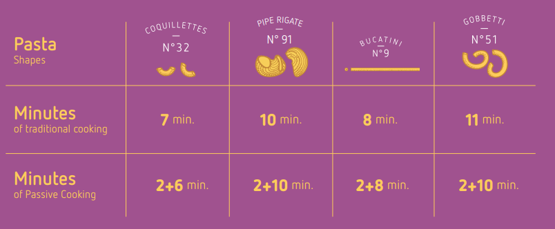

# Barilla Passive Cooking Device

This is a repo for the Barilla Passive Cooking Pasta Thermometer. Cook smarter!

## Overview
The Barilla Pasta company started a [passive cooking ad campaign](https://www.barilla.com/en-gb/passive-cooking) that included an opensource arduino sketch and 3d print files to build a device to aid in accurate passive cooking of pasta.

The arduino code was shared as a zip file, and so I have started this repo to create a community around the device. At some point I want to tweak it to work for hard boiling eggs following the method as prescribed in [The Food Lab](http://www.kenjilopezalt.com/)

## How it works
Thermometer -> Arduino -> BLE -> smartphone notifications

## Device
The original sketch targets the Arduino Nano

## Smartphone App
The companion Barilla Smartphone app is close sourced https://play.google.com/store/apps/details?id=com.passivecooker

## Technique
Barilla shared a nice table of cooking times (you don't need this device of course).
Boil then add pasta for "cook time" and then turn off heat...

